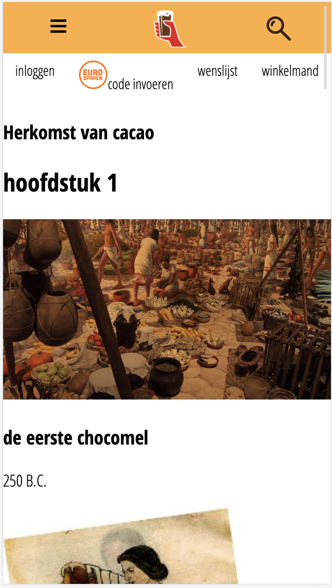
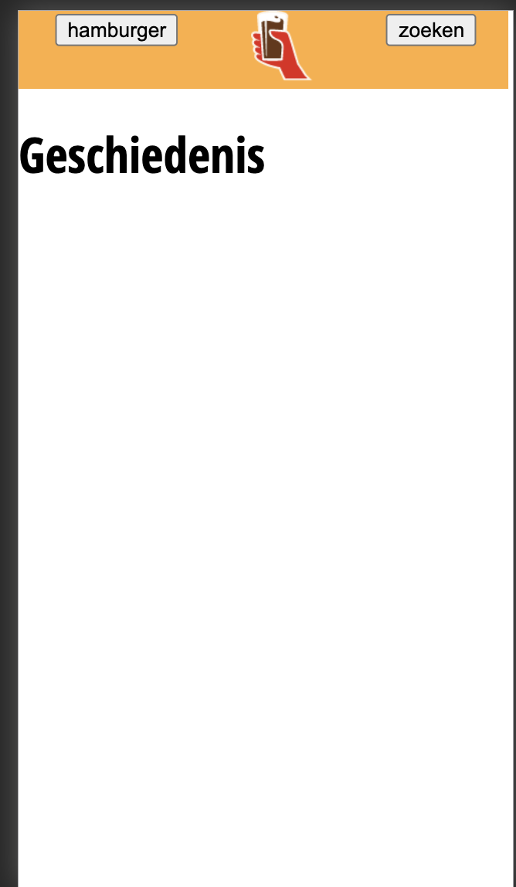
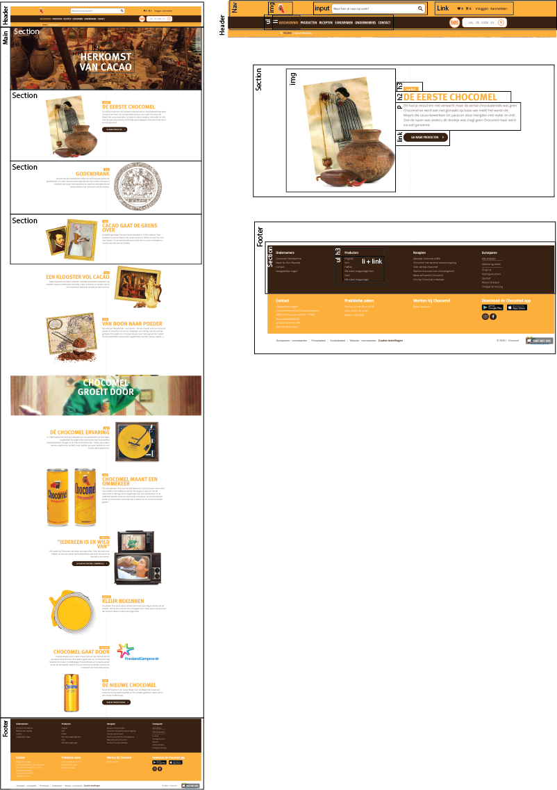
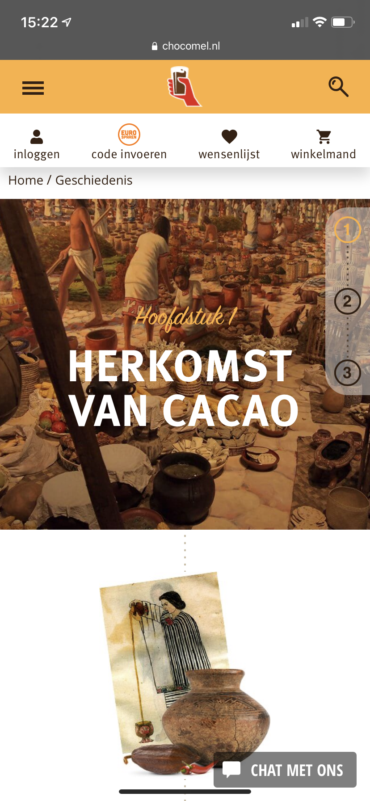
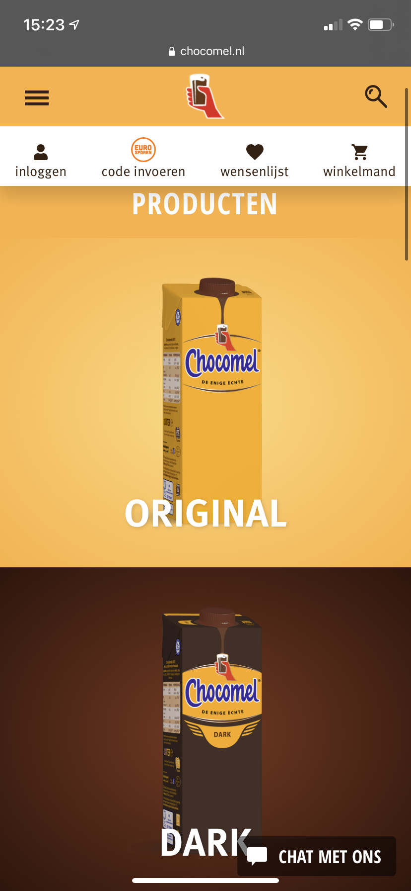

# Procesverslag
**Auteur:** -Julia Zwarthoed-

Markdown cheat cheet: [Hulp bij het schrijven van Markdown](https://github.com/adam-p/markdown-here/wiki/Markdown-Cheatsheet). Nb. de standaardstructuur en de spartaanse opmaak zijn helemaal prima. Het gaat om de inhoud van je procesverslag. Besteedt de tijd voor pracht en praal aan je website.

## Bronnenlijst
1. -bron 1-
2. -bron 2-
3. -...-

## Eindgesprek (week 7/8)

-dit ging goed & dit was lastig-

**Screenshot(s):**

-screenshot(s) van je eindresultaat-

## Voortgang 3 (week 6)

-same as voortgang 1-

## Voortgang 2 (week 5)

### Stand van zaken

Ik doe echt mijn best maar vaak weet ik niet goed welke code ik moet gebruiken, maar als het uitgelegd wordt vind ik het heel logisch. het gaat de goede kant op met mn website, er staat nu content in en mijn header is meer uitgebreid niet dat het er goed uit ziet, maar toch.

**Screenshot(s):**

### Agenda voor meeting

-samen met je groepje opstellen-

| Caro           | Anne-Fleur         | Hind         | Julia            |
| ---            | ---                | ---          | ---              |
| nav positioneren |                  |              |tekst onder img in nav        |
| sub menu's     |                    |              |                  |
| ...            | ...                | ...          | ...              |

### Verslag van meeting

We hebben hamburger menu's besproken en ik heb nu een werkend hamburger menu in mijn website!

## Voortgang 1 (week 3)

### Stand van zaken

Ik ben te laat begonnen en niks ging goed. Ik weet niet goed waar ik moet beginnen. Ik doe mn best om voor het gesprek nog wat meer af te hebben maar voor nu is het tijd om in te leveren.

**Screenshot(s):**

### Agenda voor meeting

-samen met je groepje opstellen-

| Caro           | Anne-Fleur         | Hind         | Julia            |
| ---            | ---                | ---          | ---              |
| hamburger menu | ook hamburger      | hetzelfde    | hetzelfde        |
| an dat ook nog | positioneren       | nog een punt | dit wil ik zeker |
| ...            | ...                | ...          | ...              |

### Verslag van meeting

We hebben hamburger menu's besproken en ik heb nu een werkend hamburger menu in mijn website!

## Breakdownschets (week 1)

-uitwerken voor de 1e werkgroep - eind van de eerste week-

## Intake (week 1)
-uitwerken voor de kick-off werkgroep - begin van de eerste week-

**Je startniveau:** blauw

**Je focus:** surface plane

**Je opdracht:** <https://www.chocomel.nl/nl/l/geschiedenis/>

**Screenshot(s) van de eerste pagina (small screen):**

**Screenshot(s) van de tweede pagina (small screen):**

