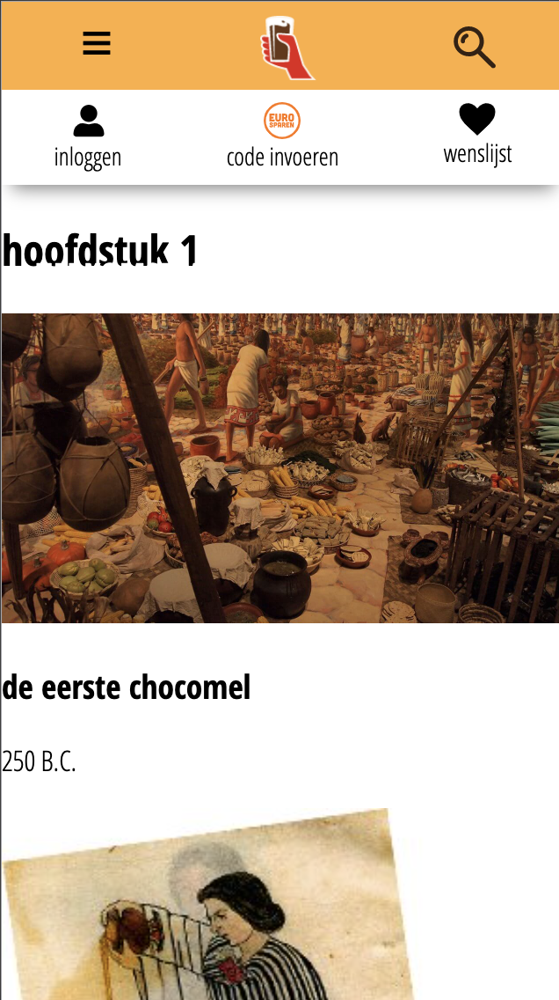

# Procesverslag
**Auteur:** -Julia Zwarthoed-

Markdown cheat cheet: [Hulp bij het schrijven van Markdown](https://github.com/adam-p/markdown-here/wiki/Markdown-Cheatsheet). Nb. de standaardstructuur en de spartaanse opmaak zijn helemaal prima. Het gaat om de inhoud van je procesverslag. Besteedt de tijd voor pracht en praal aan je website.

## Bronnenlijst
1. Slides van de lessen.
2. CSS-TRICKS almanac https://css-tricks.com/almanac/
3. CSS-TRICKS a complete guide to Flexbox https://css-tricks.com/snippets/css/a-guide-to-flexbox/
4. Stippellijn maken https://stackoverflow.com/questions/1746491/how-to-draw-a-dotted-line-with-css#:~:text=Add%20following%20attribute%20to%20the%20element%20you%20want%20to%20have%20dotted%20line.&text=Using%20hr%20created%20two%20lines,one%20solid%20and%20one%20dotted.&text=Plus%2C%20because%20you%20can%20make,when%20you%20resize%20the%20window).
5. zoekbalk html https://pagedart.com/blog/how-to-add-a-search-bar-in-html/
7. CSS-TRICKS animatie https://css-tricks.com/almanac/properties/a/animation/
8. animatie stoppen https://stackoverflow.com/questions/4359627/stopping-a-css3-animation-on-last-frame
9. CSS-TRICKS gradients https://css-tricks.com/css3-gradients/
10. anchor links https://www.w3docs.com/snippets/html/how-to-create-an-anchor-link-to-jump-to-a-specific-part-of-a-page.html

## Eindgesprek (week 7/8)

Toen ik eenmaal in de flow zit ging alles veel beter! google was wel mijn beste vriend, maar toch.Ik heb mijn best gedaan om zo veel mogelijk animaties toe te voegen, maar dit vond ik wel lastig, ik kon ook niet zo veel plaatsen vinden waar ik ze toe kon voegen. Vooral bij de zoekbalk ging het niet soepel, die is ook nog steeds niet zoals ik het wil, maar helaas heb ik niet genoeg tijd meer om hem te perfectioneren. Ik ben best trots op hoe het uiteindelijk geworden is, maar heb spijt dat ik er in het begin niet meer tijd voor vrij gemaakt heb. Toen ik goed bezig was vond ik het stiekem best leuk om te doen.
Wat goed ging:
 - Mijn skills verbeteren. Ik heb veel geleerd, code lijkt eindelijk niet meer op chinees.
 - HTML. Dit was redelijk simpel
 - Informatie vinden op internet. Als je weet wat je zoekt heb je het antwoord zo gevonden.

Wat minder goed ging:
 - Positioneren. Uiteindelijk is het (zo goed als) gelukt, maar ik had hier in het begin erg veel moeite mee.
 - Plannen! Zoals je in dit procesverslag kunt zien ben ik erg goed in uitstellen.
 - De stipjes op de achtergrond. Hier heb ik heel lang van alles mee geprobeerd en het ging elke keer mis. Het is nu wel gelukt, maar het is nog niet zo netjes als dat ik het eigenlijk zou willen.
 - CSS netjes houden. Ik vond het lastig om hier echt een structuur in te maken.
 - De navigatie aan de zijkant. Wederom is het niet zo netjes als dat ik zou willen, maar het werkt wel! Het lukte me niet om het deel waar je zat op de pagina oranje te maken.
 - Om hulp vragen. Hier ben ik in het algemeen niet zo goed in, ik zoek alles liever zelf uit, al komt dit soms tot een minder goed resultaat.

**Screenshot(s):**
 
  
   
    
     

## Voortgang 3 (week 6)

screenreader:
Ik snap helemaal niks van deze screen reader. Hij zegt constant dingen zoals “you’re currently on a tekst element inside a group” en dat soort dingen. Als ik een foto selecteer zegt hij “unlabled image”. Ik kan niet zorgen dat de screenreader iets voorleest door middel van mijn pijltjes te navigeren (Misschien snap ik gewoon niet hoe dit moet, maar hoe moeilijk kan het zijn?).
Er staan veel woorden in capslock op de chocomel website, deze leest de screenreader letter voor letter voor. Ik zet nu snel deze screenreader uit want ik krijg er hoofdpijn van.
De toegankelijkheid van de chocomel website is dus totaal niet goed! Er is veel wat ik eraan kan verbeteren. Ik zorg er bijvoorbeeld voor dat al mijn images een goede alt tekst hebben en titels niet geschreven zijn in uppercase, maar er alleen zo uitzien door middel van text-transform.

Deze week had ik het erg druk met design patterns en project web. Hierdoor ben ik opnieuw niet veel verder gekomen. Ik vind het nog steeds lastig, waardoor elk klein dingetje best lang duurt. In de kerstvakantie ga ik goed aan de slag want dan heb ik toch alle tijd!

## Voortgang 2 (week 5)

### Stand van zaken

Ik doe echt mijn best maar vaak weet ik niet goed welke code ik moet gebruiken, maar als het uitgelegd wordt vind ik het heel logisch. het gaat de goede kant op met mn website, er staat nu content in en mijn header is meer uitgebreid niet dat het er goed uit ziet, maar toch.

**Screenshot(s):**

### Agenda voor meeting

-samen met je groepje opstellen-

| Caro           | Anne-Fleur         | Hind         | Julia            |
| ---            | ---                | ---          | ---              |
| nav positioneren |                  |              |tekst onder img in nav        |
| sub menu's     |                    |              |                  |
| ...            | ...                | ...          | ...              |

### Verslag van meeting

We hebben hamburger menu's besproken en ik heb nu een werkend hamburger menu in mijn website!

## Voortgang 1 (week 3)

### Stand van zaken

Ik ben te laat begonnen en niks ging goed. Ik weet niet goed waar ik moet beginnen. Ik doe mn best om voor het gesprek nog wat meer af te hebben maar voor nu is het tijd om in te leveren.

**Screenshot(s):**

### Agenda voor meeting

-samen met je groepje opstellen-

| Caro           | Anne-Fleur         | Hind         | Julia            |
| ---            | ---                | ---          | ---              |
| hamburger menu | ook hamburger      | hetzelfde    | hetzelfde        |
| an dat ook nog | positioneren       | nog een punt | dit wil ik zeker |
| ...            | ...                | ...          | ...              |

### Verslag van meeting

We hebben hamburger menu's besproken en ik heb nu een werkend hamburger menu in mijn website!

## Breakdownschets (week 1)

-uitwerken voor de 1e werkgroep - eind van de eerste week-

## Intake (week 1)
-uitwerken voor de kick-off werkgroep - begin van de eerste week-

**Je startniveau:** blauw

**Je focus:** surface plane

**Je opdracht:** <https://www.chocomel.nl/nl/l/geschiedenis/>

**Screenshot(s) van de eerste pagina (small screen):**

**Screenshot(s) van de tweede pagina (small screen):**

